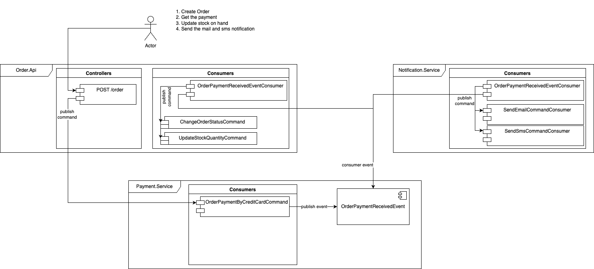

### CodeApp.MassTransit Example




## English
I tried to explain how to use Masstransit library in my youtube video.

If you are using Docker, execute the command in your CLI.
```bash
docker run -d --hostname rabbitmq --name rabbitmq -p 15672:15672 -p 5672:5672 -e RABBITMQ_DEFAULT_USER=guest -e RABBITMQ_DEFAULT_PASS=guest rabbitmq:3-management
```

Video Content
[](https://youtu.be/U9foQQlBlFc)


## Türkçe
Youtube kanalımda Masstransit nasıl kullanalınır bunu açıklamaya çalıştım.

Eğer docker kullanıyorsanız, aşağıdaki komutu çalıştırın.
```bash
docker run -d --hostname rabbitmq --name rabbitmq -p 15672:15672 -p 5672:5672 -e RABBITMQ_DEFAULT_USER=guest -e RABBITMQ_DEFAULT_PASS=guest rabbitmq:3-management
```

[](https://youtu.be/U9foQQlBlFc)


## Diagram


